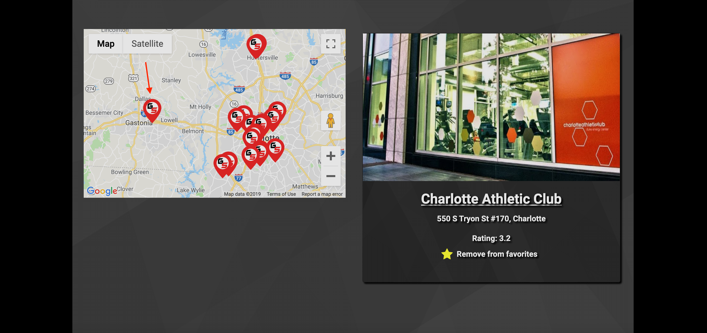
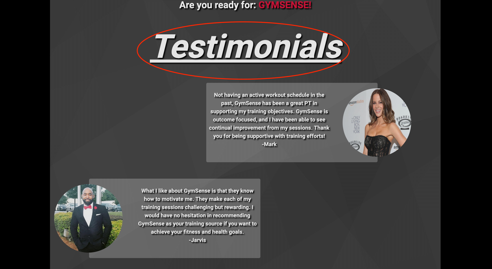
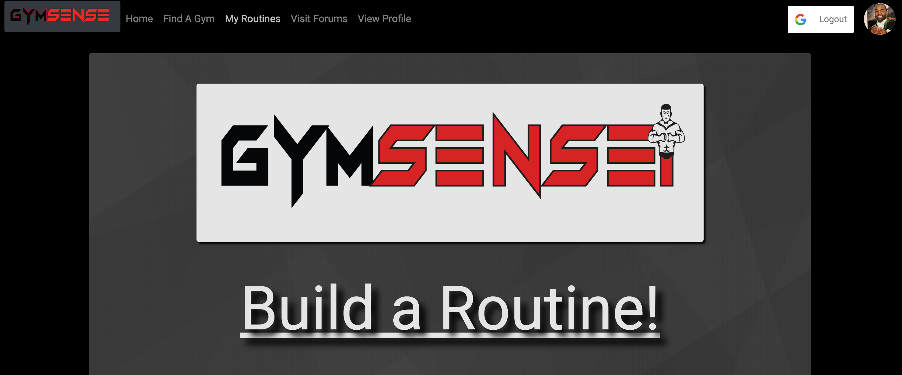
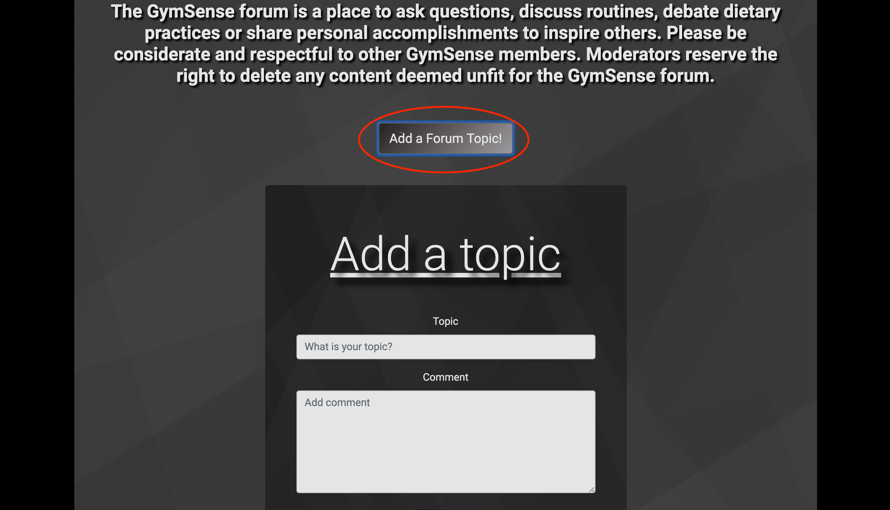
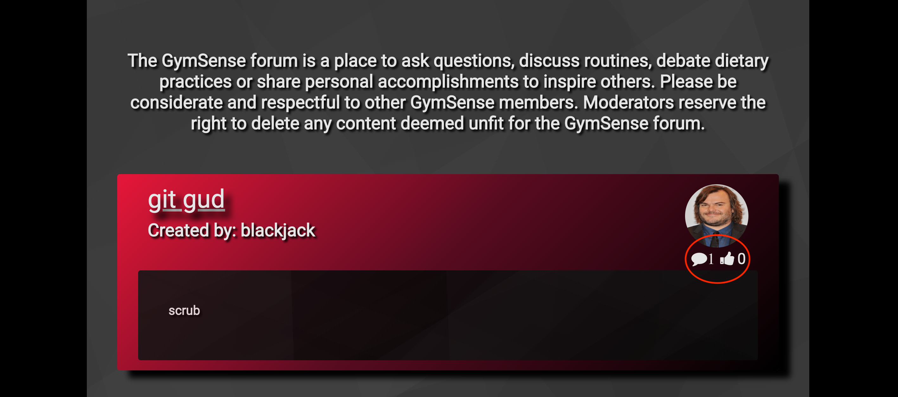

<h1 align="center">Welcome to gymsense 👋</h1>
<p>
  
  <a href="https://github.com/ABooth9422/Project3/blob/master/README.md">
    
  </a>
</p>

> The tool you need to get back in the gym  

### 🏠 [Homepage](https://guarded-peak-76174.herokuapp.com/)

## Install

```sh
npm install
```

## Usage

```sh
npm run start
```

## GymSense with app with React!
The objective of GymSense is to provide individuals with an opportunity to find gyms based on address or zip code, find routines that's most suitable to their needs and engage in discussions via the forum where other GymSense users have provided tips and insight on things that have worked well for them! GIT INTENSE...GIT GYMSENSE!!

## Take a tour of the app below...












## Technologies

## Author

👤 **Aaron Booth  Mark Bruce  Jarvis Maness  Louis Rollins  **

* Github: [@abooth9422](https://github.com/abooth9422)

## 🤝 Contributing

Contributions, issues and feature requests are welcome!<br />Feel free to check [issues page](https://github.com/ABooth9422/Project3/issues).

## Show your support

Give a ⭐️ if this project helped you!

***
_This README was generated with ❤️ by [readme-md-generator](https://github.com/kefranabg/readme-md-generator)_