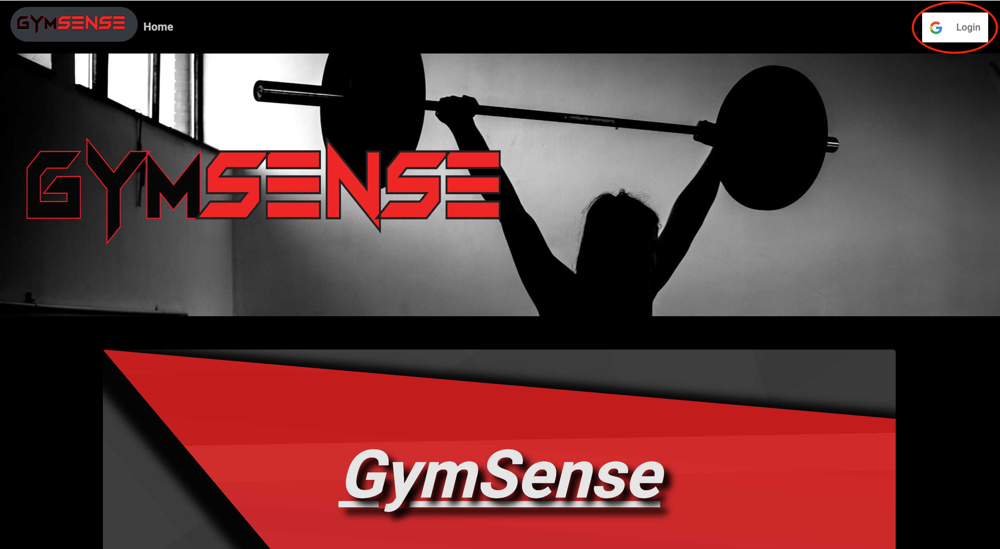

<h1 align="center">Welcome to GymSense 👋</h1>
<p>
  
  <a href="https://github.com/ABooth9422/Project3/blob/master/README.md">
    
  </a>
</p>

> The tool you need to get back in the gym  

### 🏠 [Homepage](https://guarded-peak-76174.herokuapp.com/)

## Install

```sh
npm install
```

## Usage

```sh
npm run start
```

## GymSense with app with React!
The objective of GymSense is to provide individuals with an opportunity to find gyms based on address or zip code, find routines that's most suitable to their needs and engage in discussions via the forum where other GymSense users have provided tips and insight on things that have worked well for them! GIT INTENSE...GIT GYMSENSE!!


## ```Home ```

This is the homepage where you can view our customers testimonials prior to creating a profile. If you do not choose to create a profile you are missing out on the services that we provide.



# ```Profile ```

Here is where you will be able to create a profile. This is required for full functionality of the application. After completing the profile you will have access to the full page and when you view your profile you have the opportunity to save your favorite gyms.


# ```Find a Gym ```

This page will give you the opportunity to search for a gym based on address, zip code or city. Once the information is provided you will be able to click on the gym of your choice and be provided with the the gyms name, location, rating the opportunity to save it to your profile.


# ```Routines ```

The routines page is very user friendly! You will have the opportunity to create your own workout with our routine wizard. We will provide you with the major muscle groups and prompt you for which muscle group you want a workout for and the quantity for the movements of that muscle group.


# ```Topics ```

This page will give you the capability to share a topic that you would like to discuss amongst other GymSense users. We also give you the ability to like topics of your choice. Our topics are sorted by the most likes. 


## Technologies
* Sequelize
* Google Places
* React
* Bootstrap
* MySQL
* Youtube NPM
* React Google Login
* SCSS

## Author

👤 ** Aaron Booth  Mark Bruce  Jarvis Maness  Louis Rollins **

* Github: [@abooth9422](https://github.com/abooth9422)

## 🤝 Contributing

Contributions, issues and feature requests are welcome!<br />Feel free to check [issues page](https://github.com/ABooth9422/Project3/issues).

## Show your support

Give a ⭐️ if this project helped you!

***
_This README was generated with ❤️ by [readme-md-generator](https://github.com/kefranabg/readme-md-generator)_